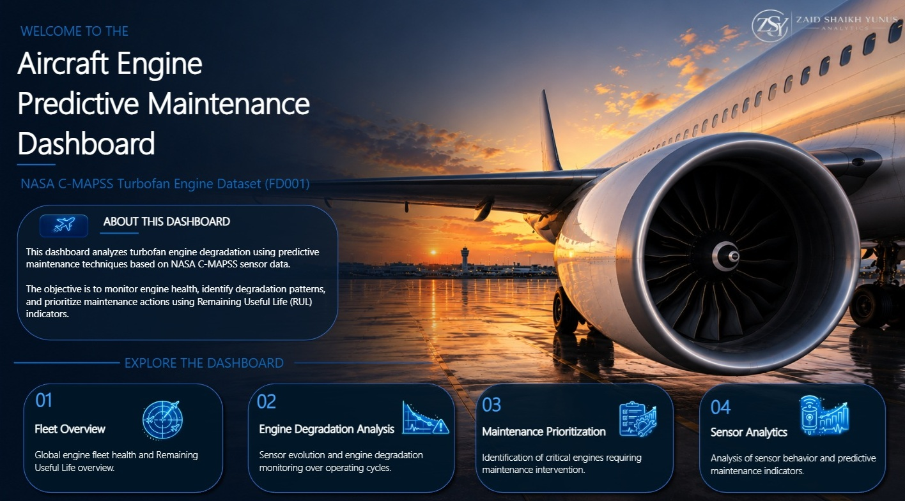

# Aircraft Engine Predictive Maintenance Dashboard

Power BI dashboard for aircraft engine predictive maintenance using NASA C-MAPSS sensor data.

## Project Overview

This project focuses on aircraft engine degradation analysis using NASA C-MAPSS sensor data. The dashboard enables Remaining Useful Life (RUL) monitoring, sensor behavior analysis, maintenance prioritization, and degradation tracking through advanced KPI engineering and interactive Power BI visualizations.

## Tech Stack

- Power BI
- DAX
- Power Query
- SQL
- Python
- Data Visualization
- Predictive Maintenance Analytics
- KPI Engineering
- Business Intelligence

## Key Features

- Fleet health monitoring
- Remaining Useful Life (RUL) analytics
- Engine degradation tracking
- Maintenance prioritization
- Sensor correlation analysis
- Signal Stability KPI
- Drift Severity KPI
- Signal Noise KPI
- Operating Range KPI
- Interactive dashboard storytelling

## Dashboard Pages

1. Fleet Overview  
2. Engine Degradation Analysis  
3. Maintenance Prioritization  
4. Sensor Analytics

## Files

- Dashboard_Nasa_Zaïd.pdf → Full dashboard export
